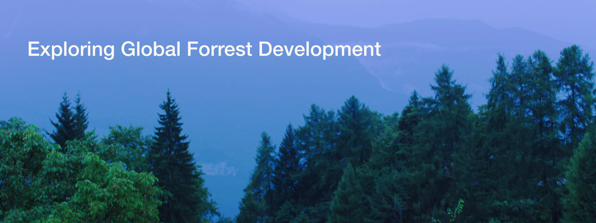
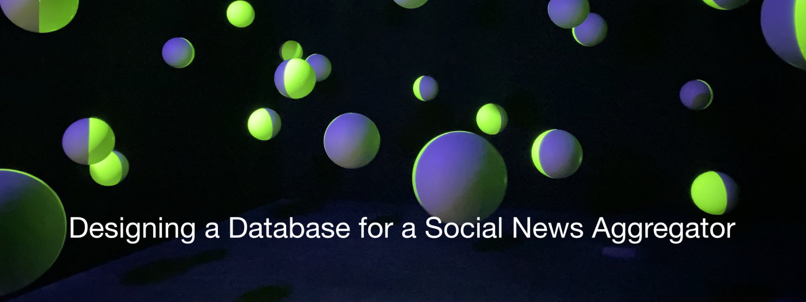

# Udacity SQL Nanodegree

## Part 1
Learned SQL fundamentals:
* define sql queries, use aliases, filter data
* data cleaning 
* join data tables with INNER, LEFT and RIGHT joins
* aggregate data (e.g. with COUNT, SUM, AVERAGE)
* define subqueries, temporary tables and window functions
* advanced joins: joins with comparison operators, self joins
* performance tuning

	
## Project 1: Explore Global Deforestation
In this project I applied the skills learned in part 1 of the course to explore global deforestation in order to delineate in which countries it is most usefuel to invest efforts in order to reduce global deforestation. I wrote sql queries to complete the missing information in a report template. Apart from section 5 "Recommendations" the text in the report template was proviced by Udacity. For SQL code of queries see pages 7 to 16. 

## Part 2 
Management of relational databases:
* data normalization
* SQL DDL with Postgres
* design database schemas
* create tables
* ensure consistency with constraints
* indexes for database performance
* introduction to non-relational databases

## Project 2: Database Design for Social News Aggregator 
I designed and normalized a database for a social news aggregator and migrated data from a poorly designed database to my newly created database. Template with instructions was provided by Udacity. 
